# 备忘录提醒 · Memo Reminder

一个用 **Python + PySide6(Qt6)** 写的本地桌面提醒工具，专治"每天该干的事老忘"。

- 🎨 **青色 / 天蓝渐变**配色，圆角卡片 + 柔和边框 + 流畅动画，深浅色自动跟随系统
- 🔁 **复杂的重复规则**：每天 / 每周几 / 每月几号 / 工作日 / 单双周 / 每月最后一天 /
  每月倒数第 N 天 / 每月第几个周几 / 每季度，一天还能设多个提醒时间点
- 🇨🇳 **自动躲开中国法定节假日**：内置国务院公布的放假与调休安排，
  落在假期里的任务自动顺延到节后第一个工作日
- 🔔 **两种提醒同时来**：Windows 系统通知 + 右下角自定义卡片弹窗（不抢输入焦点）
- ⏰ 稍后提醒（5/10/30/60/120 分钟 / 明天）、跳过本次、休眠或关机错过的自动补提醒
- 📋 **列表 / 日历 / 统计** 三个视图：日历带任务圆点和休班角标，统计有完成率、连续打卡、分类占比
- 🖥️ 托盘常驻、开机自启、数据全存本地（SQLite）
- 📣 **班级模式（可选）**：老师在自己电脑上开个小服务发通告/作业，同学填一次密钥就能收；
  **默认关闭**，只有你主动接入才会联网，详见下面「班级模式」一节

## 界面

| 列表 | 日历 | 统计 |
|---|---|---|
| 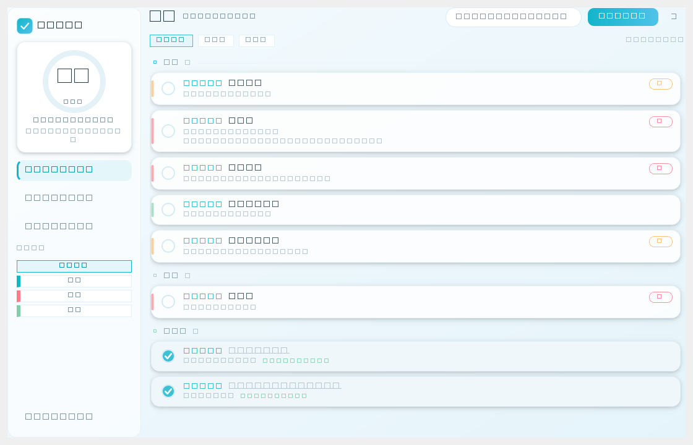 | 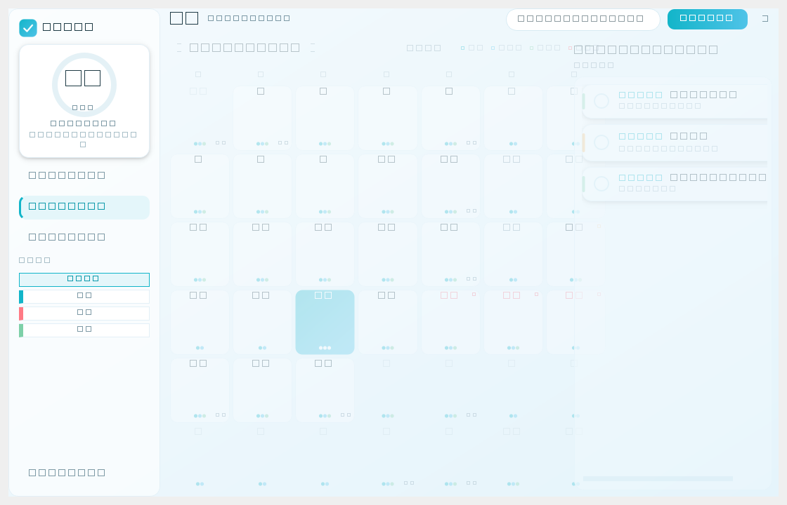 | 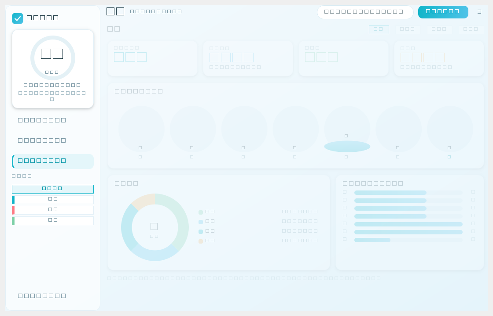 |

深色模式：

| 列表 | 日历 | 统计 |
|---|---|---|
| 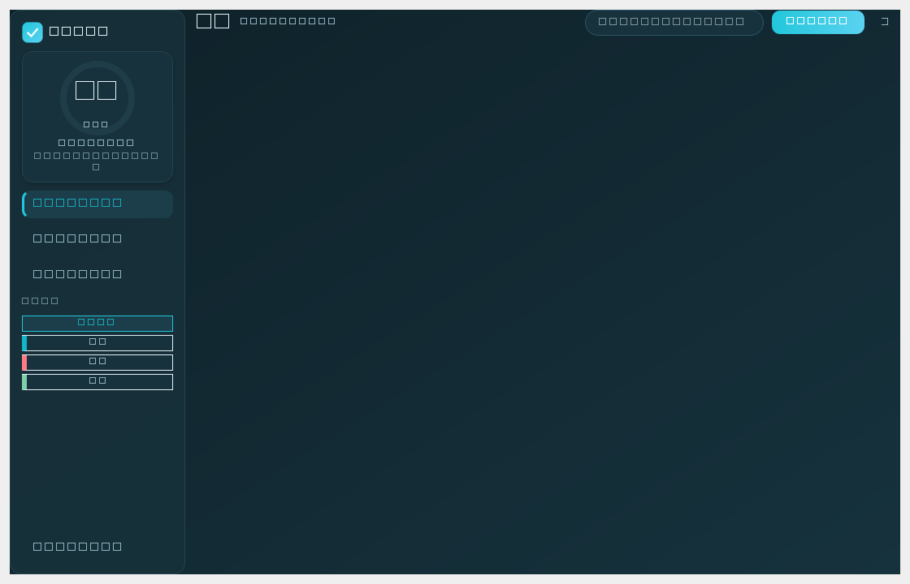 | 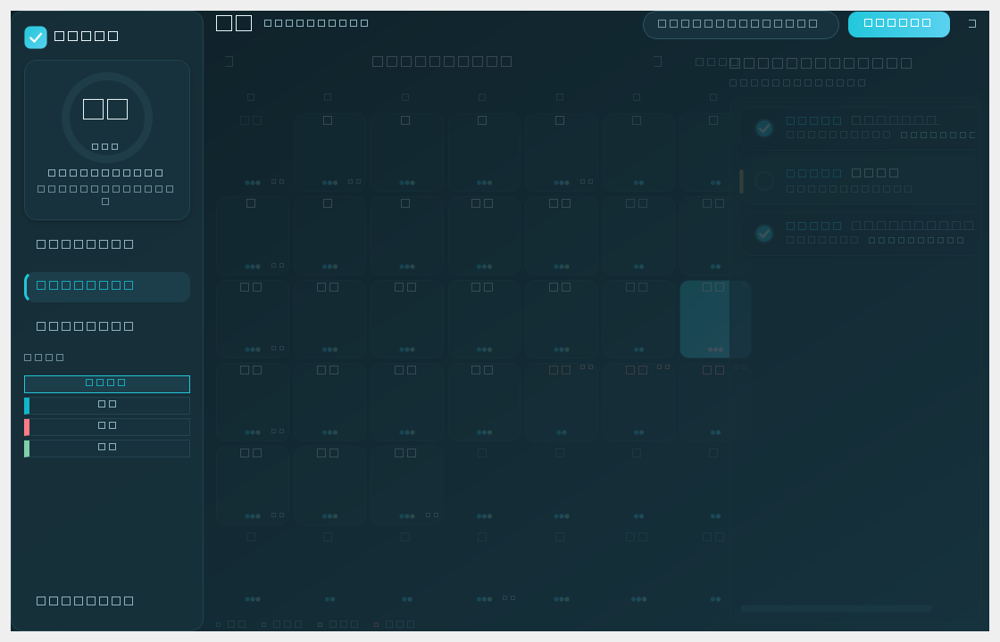 | 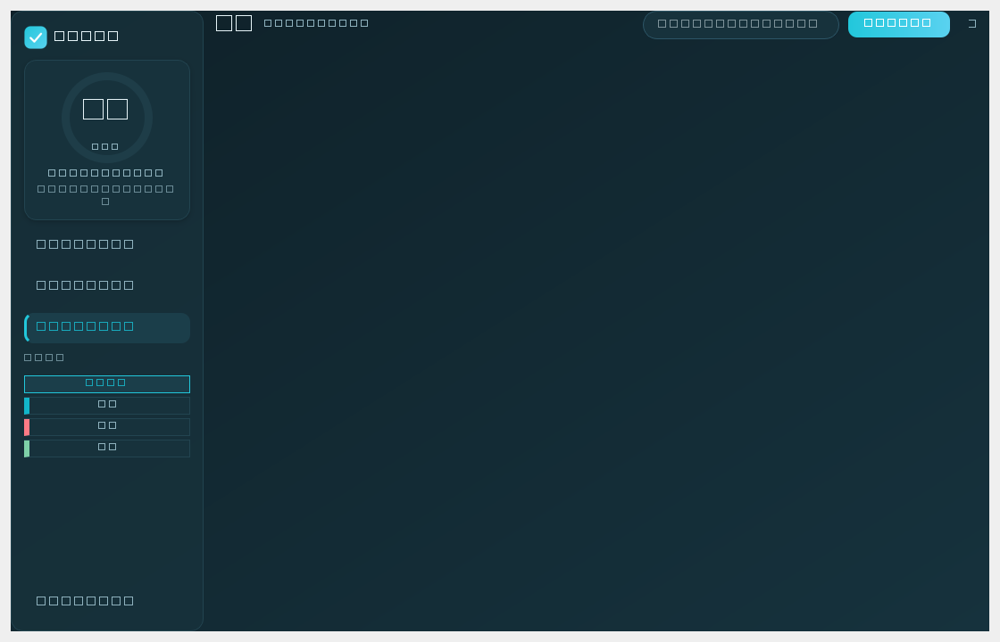 |

提醒弹窗与编辑对话框：

| 提醒弹窗（深色） | 编辑提醒（浅色） |
|---|---|
| 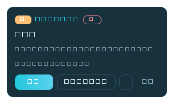 | 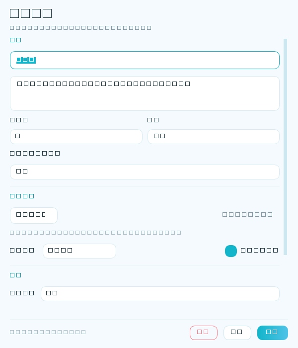 |

班级页（学生端收到老师发的通告）：

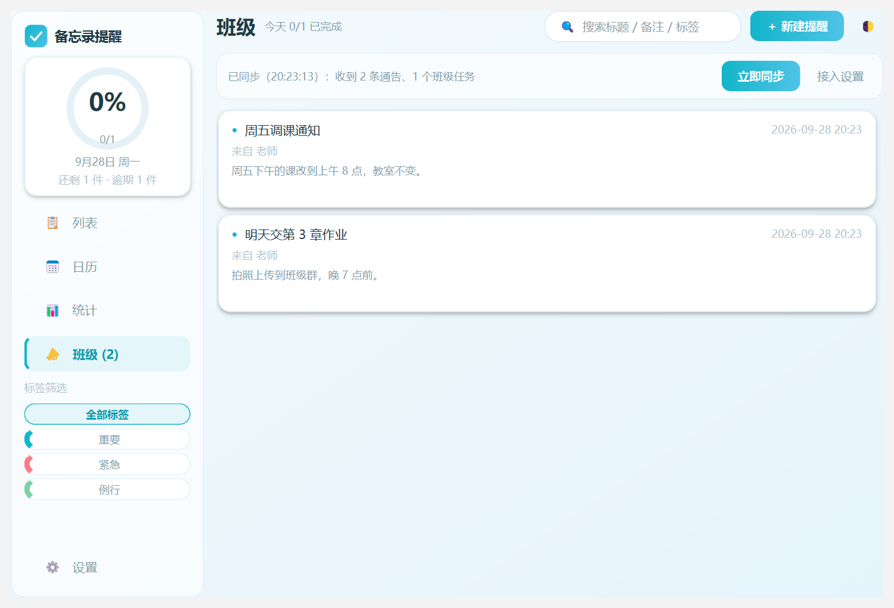

## 快速开始

```bash
# 1. 装依赖
python -m pip install -r requirements.txt

# 2. 跑起来
python main.py
```

> ⚠️ **注意**：`requirements.txt` 里 PySide6 写死了 `6.8.0.2`，**不要升级它**。
> 6.9+ 版本用 PyInstaller 打包后会在冻结进程里报
> `DLL load failed while importing QtCore`，原因见下文「踩坑记录」。

打包成 exe：

```bash
双击 build_exe.bat                      # 文件夹版（启动快，推荐）
set MEMO_ONEFILE=1 && build_exe.bat     # 单文件版（好拷贝）
```

## 技术要点

| 模块 | 干什么 |
|---|---|
| `app/recurrence.py` | 重复规则引擎，只回答两个问题：某天该不该提醒、下一次是哪天 |
| `app/holidays.py` | 法定节假日 + 调休补班表（内置 2025–2026，附官方文号） |
| `app/reminder.py` | 提醒调度：到点触发、稍后、跨天重排、休眠唤醒补提醒；提示音用标准库合成 |
| `app/database.py` | SQLite 全部读写集中在这里，界面层不写 SQL |
| `app/theme.py` | 把配色字典渲染成 QSS；图标也是代码画的，不需要美术素材 |
| `app/ui/*` | 界面：卡片、动画勾选框、自绘环形进度与图表，全部跟随主题换色 |
| `app/class_sync.py` | 班级模式客户端：增量拉取老师的通告与作业，离线静默降级 |
| `server/server.py` | 班级模式服务端：纯标准库（`http.server` + `sqlite3`），双密钥、限流 |
| `server/send.py` | 老师用的命令行发送工具（发通告 / 发作业 / 撤回 / 看谁接入了） |
| `app/admin_api.py` | 老师端管理接口：拿管理员密钥发内容、撤回、拉名单（只走 HTTP，不碰服务端数据库） |
| `app/ui/admin_view.py` | 老师端「管理」页：发通告 / 发任务 / 撤回 / 接入名单 |

几个设计取舍：

- **一天多提醒**用「主时间 + 追加时间点」实现，提醒弹过后自动排到当天下一个时间点，
  排完才推到明天
- **节假日顺延上限 14 天**（比春节 9 天连休更长），避免长假期里的任务"跳不过去"
- **统计口径统一**成"已完成 / 应做"，顶部卡片和柱状图用同一份数据算，不会互相打架
- 提醒弹窗 `WA_ShowWithoutActivating`，**不抢焦点**；鼠标移上去会暂停自动关闭
- **服务端是班级内容的唯一权威**：同学本地只是缓存，删不掉老师发的任务，
  撤回后本地也会跟着消失
- **「管理」页只走 HTTP 接口**，不直接读写服务端数据库 —— 用的就是 `send.py`
  那套接口，不会出现"命令行发得出去、界面上发不出去"的两套逻辑

## 班级模式

老师在自己电脑上开服务，同学填一次密钥就能收到统一的通告和作业。
学生端的日常使用完全不受影响 —— 老师发的东西和自己的提醒**并存**，不会互相覆盖。

**老师这边**（服务端跑在老师电脑上）：

```bash
python server/server.py                 # 启动，会打印管理员密钥、接入密钥和局域网地址
```

发内容有两种方式，走同一套接口：

- **程序里的「管理」页**（推荐）：设置里填上服务器地址 + **管理员密钥**，
  左侧就会出现 🛠️ **管理**，可以发通告、发任务、撤回、看接入名单
- **命令行**：

```bash
python server/send.py announcement "明天交作业" "第 3 章习题，拍照上传"
python server/send.py task "周五交读书笔记" --recur once --date 2026-10-09 --time 19:00
python server/send.py members           # 看谁接入了
python server/send.py withdraw-ann 1    # 撤回发错的通告
```

老师端的「管理」页（填了管理员密钥才会出现）：

| 发通告 / 发任务 | 已发布（可撤回） | 接入名单 |
|---|---|---|
| 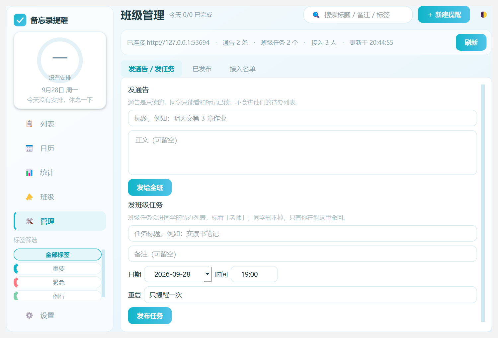 | 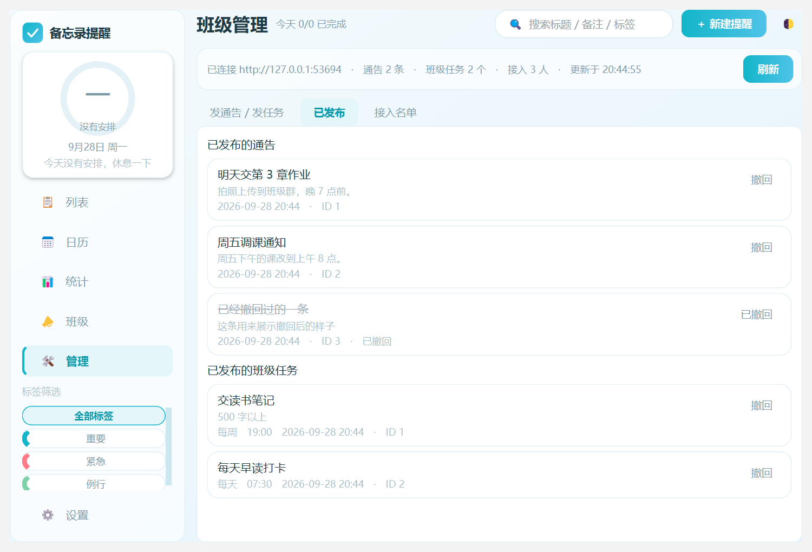 | 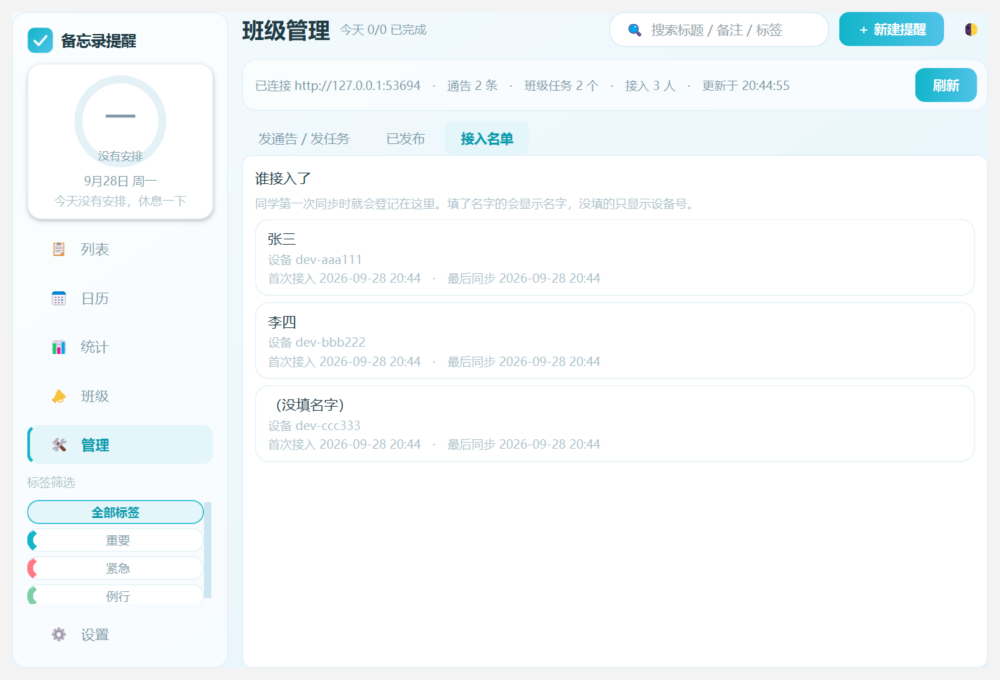 |

上面三张是离屏渲染的效果图；下面是**打包好的 exe 真跑起来**、连上服务端之后的样子
（状态栏能看到实时统计）：

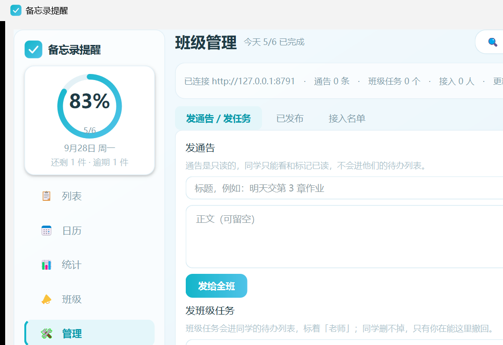

按老师给的地址，同学端**设置 → 班级接入**里填服务器地址 + 接入密钥即可
（**管理员密钥不要给同学**，填了才会出现「管理」页）。
详细步骤、防火墙放行命令见 [`server/使用说明.md`](server/使用说明.md)。

> ⚠️ **几个必须知道的限制**，别踩了才后悔：
> - 服务端跑在**老师的电脑**上，**老师关机就收不到**。「发完就关机」做不到，
>   要那样得有一台一直开着的机器（学校服务器 / 云主机）。
> - 走的是**明文 HTTP**，只在局域网 / 校园网内可信使用，别直接暴露到公网。
> - 通知只有**程序开着**才看得见；同学没开程序，下次打开会补上内容。
> - 密钥分两把：**管理员密钥能发内容**（只有老师拿着），
>   **接入密钥只能读**（发给同学）。接入密钥泄了最多被人看通告，发不了东西。

## 测试

```bash
python tools/smoke_test.py        # 100 项：重复规则/节假日/统计/界面构造/老库升级/管理页显隐
python tools/test_server.py       #  38 项：服务端接口、双密钥、只读与管理列表、限流
python tools/test_class_sync.py   #  53 项：端到端同步 + 班级页各种通告形状
python tools/test_send_cli.py     #  17 项：老师命令行工具
python tools/test_admin.py        #  50 项：老师端管理页（真构造控件、真起服务端）
python tools/verify_reminder.py   # 端到端：真的把程序跑起来，验证提醒会弹（约 100 秒）
python tools/render_preview.py    # 离屏渲染界面截图，不需要显示器
python tools/seed_data.py         # 造示例数据
```

`verify_reminder.py` 是当初抓到一个真 bug 的工具：提醒弹出后没有推进下次时间，
导致同一条任务每 10 秒重复弹一次刷屏。现在它作为回归测试保留。

测试有三条自己踩出来的规矩，改代码时请照做：

1. **新写的回归测试，要把 bug 塞回去跑一遍，确认它真的会失败。**
   曾经有两个版本的柱状图测试是"永远通过"的假测试，白高兴一场。
2. **界面类 bug 必须有真构造控件的测试。**
   `AnnouncementCard` 曾把 `_refresh_body()` 写在 `self.hint` 创建之前，
   只要有**一条带正文的通告**，同学一点开「班级」页就崩 ——
   而当时所有纯逻辑测试全是绿的，因为没人真去构造那个卡片。
3. **同一件事只能有一处判定逻辑，否则测试会被"兜住"。**
   「管理」页的显隐一度有两道（侧边栏默认隐藏 + `_update_admin_nav()`），
   结果改坏其中一道，测试照样全绿。现在只留 `_update_admin_nav()` 一处。

## 踩坑记录

### PySide6 版本导致 exe 起不来

**症状**：打包后的 exe 一启动就报
`ImportError: DLL load failed while importing QtCore: 找不到指定的程序`。

**排查**：用最小复现（只 `import PySide6` 就打包）、换 PyQt6、把源目录 DLL
全量拷进打包目录三种方式对照，**全都在冻结进程里同样失败**；而完全相同的 DLL
（md5 一致）在普通 Python 进程里加载正常。确认是 PyInstaller 冻结环境与
Qt 6.9+ 的兼容问题，不是项目代码问题。

**解决**：PySide6 钉在 **6.8.0.2**（Python 3.13 能装的最老版本，6.7.x 不支持 3.13）。

### 中文控制台编码

工具脚本输出中文时，Windows 控制台默认 GBK 会抛 `UnicodeEncodeError`，
所以报告会同时写一份 UTF-8 文件（如 `smoke_report.txt`）。

这个坑不止烦人，还会**骗人**：写临时验证脚本时 `print("✓ ...")` 会在最后一步崩掉，
看起来像"被测代码有问题"；更坏的一次是主窗口截图脚本里 `print` 崩了，
把后面的 `app.quit()` 一起带走，窗口永远关不掉、命令直接超时。
规矩：**临时脚本一律 `sys.stdout.reconfigure(encoding="utf-8")`，
清理类的调用放 `finally`。**

### 老用户的数据库打不开

班级模式给 `tasks` 加了 `source` / `remote_id` 两列。第一版顺手把
`CREATE INDEX ... ON tasks(source)` 写进了建表语句 `_SCHEMA`，结果**老用户一升级，
程序直接起不来** —— 旧库还没有这一列，建索引就报 `no such column: source`。

**规矩**：加了新列，**依赖它的索引必须写进 `_migrate()`、等 `ALTER TABLE` 补完列再建**，
不能留在 `_SCHEMA` 里。`smoke_test.py` 第 7 节会造一个旧结构的库盯着这件事。

## 使用说明

详细的安装、功能、数据位置、常见问题见下面的章节。

---

## 一、在 PyCharm 里改代码（第一次）

1. **打开项目**
   `File → Open` → 选择项目目录 → 确定。

2. **确认解释器是 Python 3.13**
   `File → Settings → Project → Python Interpreter`
   如果列出的不是你要用的解释器，点齿轮 →
   `Add Local Interpreter → System Interpreter` 选对应的 `python.exe`。
   > 不要用 32 位的旧版 Anaconda，PySide6 装不上。

3. **装依赖**（Terminal 里执行，只有第一次需要）
   ```
   python -m pip install -r requirements.txt
   ```
   > ⚠️ 依赖里 PySide6 写死了 `6.8.0.2`，**不要升级它**，原因见上面「踩坑记录」。

4. **运行**
   在项目树里右键 `main.py` → `Run 'main'`。

5. **日常启动**
   双击打包好的 exe，或双击 `run.bat`（源码方式启动）。
   想看报错就用 `run_debug.bat`（保留控制台窗口）。

---

## 二、日常怎么用

| 想做的事 | 怎么做 |
|---|---|
| 加一条提醒 | 右上角「＋ 新建提醒」，或托盘图标右键 →「新建提醒…」 |
| 修改 / 删除 | 单击任务卡片打开编辑；或双击；或卡片右边悬浮后点「删除」 |
| 标记完成 | 点卡片左边的圆圈（有打勾动画） |
| 稍后再说 | 卡片悬浮 →「稍后」；提醒弹窗上也有「稍后 10 分」和下拉可选 5/30/60/120 分钟、明天 |
| 跳过这一次 | 卡片悬浮 →「跳过本次」（只跳过今天，规则不变） |
| 看某天的安排 | 左侧「日历」，点某一天，右边列出当天任务 |
| 看完成情况 | 左侧「统计」，可切本周 / 近两周 / 近一月 / 近三月 |
| 只看看某类 | 左侧「标签筛选」点标签；顶部搜索框可搜标题、备注、分类、标签 |
| 关掉窗口 | 默认最小化到托盘继续提醒；托盘图标双击可再打开 |
| 彻底退出 | 托盘图标右键 →「退出」 |

**提醒会怎么出现**：到点同时弹两样东西 —— 右下角滑入一张卡片（不抢你的输入焦点），
加一条 Windows 系统通知（进通知中心，错过还能看到）。还会响一声柔和的提示音。
电脑休眠期间错过的提醒，开机或唤醒后会补一次，标题上带一个「补」标记。

---

## 三、重复规则支持哪些

新建提醒时「重复」那一栏可以选：

- 只提醒一次（指定某一天）
- 每天
- 每周（可多选星期几）
- 每月几号（可多选，如 `1,15,30`）
- 每个工作日（**自动跳过法定节假日，调休上班日照常提醒**）
- 每隔一周的周几（单双周，可设基准日）
- 每月最后一天 / 每月倒数第 N 天（例：倒数第 3 天 = 提前准备）
- 每月第几个周几（例：`1,3,-1` = 第一个、第三个、最后一个周三）
- 每季度（首日 / 末日 / 第 N 天 / 第 N 个工作日）

**躲开节假日**：默认开启。落在放假期间的任务会自动顺延到节后第一个工作日，
卡片上会标「因假期顺延」，日历对应日期也显示「休 / 班 / 节日」角标。

内置的节假日数据来自国务院办公厅通知（2025、2026 两年）。
**2027 年的安排通常在 2026 年 11 月公布**，公布后有两种更新办法：

- 简单办法：程序里「设置 → 法定节假日 → 额外放假日期」，一行一个日期填进去；
- 彻底办法：编辑 `app/holidays.py`，把 `HOLIDAYS_2027` 和 `MAKEUP_2027` 两个列表填上。

---

## 四、已经打包好了（不用你再动手）

**两个版本都在 `E:\Memo\备忘录提醒\` 里，随便用哪个：**

| 文件 | 说明 |
|---|---|
| `备忘录提醒.exe`（+ `_internal` 文件夹） | **文件夹版**，启动 1~2 秒，推荐平时用。`_internal` 必须和它放一起，整个文件夹一起拷。 |
| `备忘录提醒-单文件版.exe` | **单文件版**，61.5 MB，只有一个文件好拷贝；代价是每次启动要自解压，**约 5~10 秒**。 |

**数据位置**：`E:\Memo\data\memo.db`（和程序分开，升级程序不丢数据）

已经替你做完的：
- ✅ 两个版本都打包好并实测能跑（主窗口正常弹出）
- ✅ 开机自启已写入注册表（`HKCU\...\Run\MemoReminder`），指向文件夹版
- ✅ 桌面快捷方式和开始菜单快捷方式都已创建
- ✅ 开机静默启动到托盘，到点自动提醒

**改完代码后重新打包**：
```
双击 build_exe.bat                                   :: 文件夹版 -> dist\
set MEMO_ONEFILE=1 && build_exe.bat                  :: 单文件版 -> dist\
```
然后把 `dist\` 里的东西覆盖到 `E:\Memo\备忘录提醒\`。

> ⚠️ **两个版本别搞混**：单文件版要输出到**单独的目录**，否则它会覆盖文件夹版共用的
> `_internal`，导致 `备忘录提醒.exe`（旧）配 `_internal`（新）——
> 症状是**双击后弹一个全白窗口**。踩过一次，查了半天。
> 出这种症状就两个一起重新打包，别只补一个。

---

## 四·补：踩过的坑（重要，别踩第二次）

### 坑 1：PySide6 版本导致 exe 起不来（详见上文「踩坑记录」）

把 PySide6 钉在 **6.8.0.2**。升级它之前，一定要先重新打包验证一次 exe 能不能起来。

### 坑 2：提醒弹过一次后不会重排（已修）

**症状**：任务到点弹了提醒，如果你没点"完成"就让它自己消失，
这条任务会停在"已过期"状态 —— 于是**每 10 秒又弹一次**，一直刷屏。

**原因**：调度器在触发提醒后没有把 `next_at` 推到下一次。

**修复**：`app/reminder.py` 的 `_fire()` 现在会先调 `_advance()` 把下次时间
推到未来（当天还有追加时间点就排到那个点，否则排到明天），
并且用 `_pending` 保证同一天不重复打扰。

**回归测试**：`python tools\verify_reminder.py` 会真的把程序跑起来、造一条
几十秒后到点的任务、检查是否"只弹一次 + next_at 已推进 + 错过会补提醒"。
这个脚本就是当初抓到坑 2 的工具，改调度相关代码后务必跑一遍。

---

## 五、数据与备份

| 内容 | 位置 |
|---|---|
| 数据库（所有提醒和完成记录） | `E:\Memo\data\memo.db` |
| 界面偏好 | `E:\Memo\data\ui_settings.json` |
| 自动备份（保留最近 20 份） | `E:\Memo\data\backup\` |
| 出错日志 | `E:\Memo\data\memo.log` |
| 提示音（程序自己合成的） | `E:\Memo\data\chime.wav` |

- 每次正常退出会自动备份一次；也可以「设置 → 立即备份」手动备。
- 「设置」里能导出 CSV（Excel 可直接打开）和 JSON（可用于迁移）。
- 重新打包 exe、升级程序都**不会**动 `E:\Memo\data\`，所以数据不会丢。

---

## 六、给开发者的部分（想改代码看这里）

```
main.py                 启动入口：单实例、托盘、开机自启
app/config.py           ★ 路径 / 配色 / 默认设置  —— 想换颜色改这里
app/database.py         SQLite 建表与读写
app/models.py           Task / Tag 数据类
app/holidays.py         法定节假日 + 调休表
app/recurrence.py       ★ 重复规则引擎（哪一天该提醒）
app/reminder.py         提醒调度（什么时候弹、错过怎么补、提示音合成）
app/stats.py            完成率 / 连续打卡 / 分类占比
app/theme.py            主题（QSS 样式表）与图标生成
app/ui/main_window.py   主窗口 + 侧边栏 + 设置对话框
app/ui/views.py         列表 / 日历 / 统计三个视图
app/ui/dialogs.py       新建·编辑提醒对话框（含重复规则 UI）
app/ui/popup.py         右下角提醒弹窗
app/ui/widgets.py       通用零件：圆角卡片、柔和阴影、动画勾选框、环形进度
app/ui/tray.py          托盘图标与右键菜单
tools/smoke_test.py     ★ 冒烟测试：改完代码先跑这个（68 项，秒级）
tools/verify_reminder.py ★ 端到端提醒实测：真的跑程序验证提醒会弹（约 100 秒）
tools/render_preview.py 离屏渲染界面截图（不需要显示器）
tools/render_real.py    真机渲染截图（窗口会闪现一下）
tools/seed_data.py      造示例数据
```

**改完代码建议先跑**：
```
python tools\smoke_test.py           # 结果同时写到 smoke_report.txt
python tools\verify_reminder.py      # 改了调度/提醒逻辑后必跑
```

---

## 七、常见问题

**Q：提醒没响？**
1. 看托盘图标还在不在（在的话程序还活着）；
2. 「设置 → 提醒方式」确认弹窗和系统通知都勾着；
3. 看 `E:\Memo\data\memo.log` 和「设置」里最后几条 `fire_log`；
4. 系统「设置 → 系统 → 通知」里别把本程序的通知关掉；
5. 专注助手 / 游戏模式开启时会屏蔽通知。

**Q：开机没有自动启动？**
「设置」里确认「开机自动启动」是勾上的，然后保存一次。
它写的是注册表 `HKCU\Software\Microsoft\Windows\CurrentVersion\Run`。

**Q：exe 启动时被 Windows 拦了？**
因为程序没有花钱买代码签名证书，选「更多信息 → 仍要运行」即可。

**Q：想清空所有数据重新来？**
「设置 → 清空所有提醒」（清空前会自动备份一次）。
